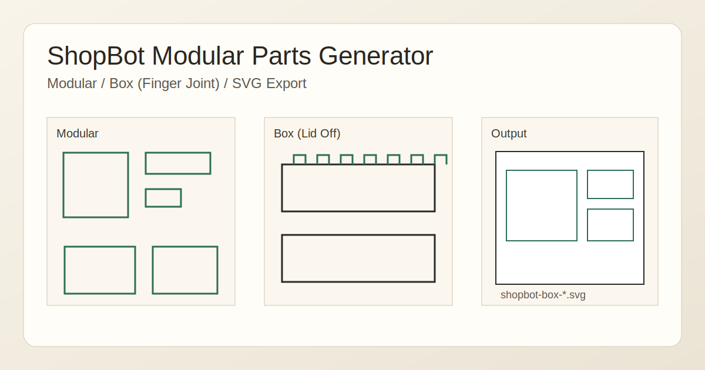

# ShopBot Modular Parts Generator

合板の廃材から家具パーツを生成し、`SVG` で書き出すための `p5.js` ツールです。

## Features
- `Modular` タブ
  - `PANEL` / `BRACE` / `CORNER` を自動生成
  - 組み替え前提のモジュール構成
- `Box` タブ
  - `TOP/BOTTOM/FRONT/BACK/LEFT/RIGHT` をセット生成
  - フィンガージョイント（凹凸）はめ込み形状
  - `上面に蓋パネルを付ける` OFF で `TOP` なし + 側板上辺フラット
  - 棚用途で並べやすいオープンボックスに切り替え可能
- 共通
  - mm単位パラメトリック調整
  - 板厚 / クリアランス / エンドミル径を反映
  - シート内自動配置（入り切らない分は `dropped` 表示）
  - `SVG` ワンクリック保存

## Quick Start
1. `/Users/matsuzakihirofumi/testcodex/furniture-modules/index.html` をブラウザで開く
2. `Modular` または `Box` タブを選ぶ
3. 寸法と加工条件を入力
4. `再生成` で確認
5. `SVG保存` でCAM用データを書き出し

## Main Parameters
- `sheetW`, `sheetH`: 材料シートサイズ
- `thickness`: 板厚
- `clearance`: はめ込みクリアランス
- `toolDia`: エンドミル径
- `gap`: 部品間隔
- `edgeSlots`: スロット/フィンガー密度

## CNC Notes
- 単位は `mm`
- スロット幅の基準は `板厚 + クリアランス`
- 内角逃がしとして簡易 dogbone 円を出力
- CAM側で `外形` と `内形` の工具経路を分けて設定
- 実材公差があるので、端材で試し切りして `clearance` を調整

## Planned
- 実際の画面キャプチャ画像の追加
- 組み立て例（棚構成）のGIF追加
